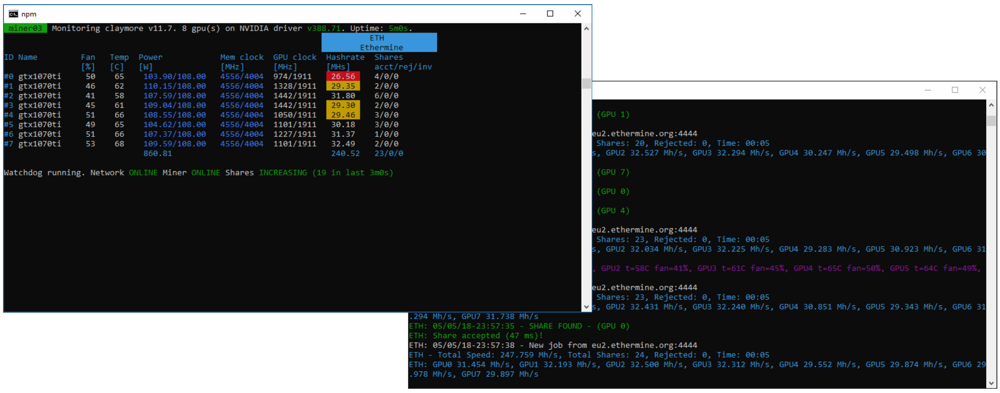

# mining-mon - Mining tools for Windows

Complete solution for mining software management with integrated monitoring and watchdog

## Features
- Hardware monitoring (CPU temp, FAN speed, GPU power usage, GPU memory clocks, GPU clocks)
- Miner monitoring (hashrate, shares)
- Watchdog with miner restart (internet connection monitoring, mining software responsiveness, accepted shares increase)
- Log files for easier retracing what was happening the the miner
- WWW server for easier log access and server metrics
- Pushover.net integration for mobile notifications
- Autoupdate
- Nice console UI 😊

## Supported hardware
- NVIDIA cards only - sorry AMD

## Supported miners
- [Claymore's Dual Miner](https://bitcointalk.org/index.php?topic=1433925.0) (both single and dual modes) 
- [CCMiner](https://github.com/tpruvot/ccminer/releases) (in progress....) 

## Requirements
- git client 
- nodejs v9.9.0+

## Installation & configuration
1. After checking out the repository run: `npm install`
2. Place config files in mining-mon root directory. See `config-examples` directory for details

App reads config in order:
1. `worker.conf` (general worker / rig configuration like worker name, wallets, pools etc.), 
2. `run.conf` (miner and monitor configuration, what and how to mine)
3. `run-${worker_name}.conf` (worker specific configuration)

You can use all configuration files at once. It all depends what is your preferred way of configuring workers. If you own only one mining server - just one file - `run.conf` should be fine. Variables from later override existing variables. You can use variables in `${variable}` format. Either `run.conf` or `run-${worker_name}.conf` is required.

## Web server
App serves `/status.json` and `/rig_state.json` files. App logs are accessible in `/log` dir. Current mining app log file is accessible at `/log/run.log`. Current miner log file is accessible at `/log/miner.log`
Default web server port is `8181`

## Changelog

v1.3.0
- New: Autoupdate function. miner-mon will periodically pull changes from git and restart itself if new version is detected

v1.2.0
- New: Auto remove old log files

v1.1.0:
- New: Added support for worker specific config file
- New: Added app version info
- New: Some pushover message formatting tweaks
- Bug: mining-mon start and miner start reported to pushover the same way

v1.0.0:
- First version

## Roadmap (future plans)
See https://github.com/drkn/mining-mon/projects/2 :)

## License
Copyright (c) 2018 Maciej Dragan

Do whatever you like but not be evil license:

1. Subject to the terms of this Agreement, you are granted a worldwide free license to use this software.
2. You may copy and distribute copies of this software.
3. You may modify this software in any way. 
3. You may use this software in both commercial and non commercial way, except for reselling its copy in both modified and unmodified versions. This software is and always will be free
4. THE SOFTWARE IS PROVIDED "AS IS", WITHOUT WARRANTY OF ANY KIND, EXPRESS OR IMPLIED, INCLUDING BUT NOT LIMITED TO THE WARRANTIES OF MERCHANTABILITY, FITNESS FOR A PARTICULAR PURPOSE AND NONINFRINGEMENT. IN NO EVENT SHALL THE AUTHORS OR COPYRIGHT HOLDERS BE LIABLE FOR ANY CLAIM, DAMAGES OR OTHER LIABILITY, WHETHER IN AN ACTION OF CONTRACT, TORT OR OTHERWISE, ARISING FROM, OUT OF OR IN CONNECTION WITH THE SOFTWARE OR THE USE OR OTHER DEALINGS IN THE SOFTWARE. 

## Donate
If you like my work and it saved you couple of hours setting up your rig feel free to thank me using these:

- BTC: bc1qp6gvkv3azl3lkylwpxst99l72vqpmfq3dwny8v
- ETH: 0x66bc8de886b759ab9c63c8a1992cfd95f07c04ca
- ETC: 0xae6f51e084b02111bf20fd53aacbba1e6de5b1d5
- LTC: ltc1qkvsxlc93q0u4f85wkfgagf7tmjhghe0juampn8
- XVG: D5D9ngrq73nwpccVrD8WpRnmwMugtJv5Yf